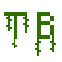

# TruthByte

<p align="center">
  
</p>

A minimal Zig+WASM game that crowdsources human truth judgments to build better LLM evaluation datasets. Play a fast round of "True or False?" — every answer trains the future.

**🎮 [Play Now: truthbyte.voidtalker.com](https://truthbyte.voidtalker.com)**

## 📚 Complete Documentation

**For comprehensive documentation, see the [`docs/`](docs/) directory:**
- **[Architecture Overview](docs/ARCHITECTURE.md)** - Complete system design and technical overview
- **[API Reference](docs/API_REFERENCE.md)** - All endpoints, authentication, and data models
- **[Database Guide](docs/DATABASE.md)** - DynamoDB schema, query strategies, and operations
- **[Development Guide](docs/DEVELOPMENT.md)** - Setup, environment variables, troubleshooting, and best practices
- **[Deployment Guide](docs/DEPLOYMENT.md)** - Infrastructure setup and deployment procedures
- **[AI Agent Specs](docs/AGENTIC_SPECS.md)** - Specifications for AI coding assistants

## Table of Contents
- [Quick Start](#quick-start)
- [Project Overview](#project-overview)
  - [Core Assumptions](#core-assumptions)
  - [System Components](#system-components)
  - [Data Flow](#data-flow)
- [Mobile & Touch Support](#mobile--touch-support)
- [Development Guide](#development-guide)
  - [Prerequisites](#prerequisites)
  - [Environment Setup](#environment-setup)
    - [EMSDK Installation](#emsdk-installation)
    - [Environment Variables](#environment-variables)
  - [Building and Running](#building-and-running)
- [Deployment](#deployment)
- [Data Structures](#data-structures)
  - [Questions](#questions)
  - [User Submission](#user-submission)
  - [User Question Submission](#user-question-submission)
- [Technical Details](#technical-details)
  - [Repo Template](#repo-template)
  - [Data Sources](#data-sources)

## Quick Start

1. **Clone and Setup**:
```bash
git clone https://github.com/yourusername/truthbyte.git
cd truthbyte
```

2. **Install Prerequisites**:
- Zig (0.14.0+)
- Python 3.13.5+
- EMSDK (for WASM)

3. **Set EMSDK**:
```bash
# Windows PowerShell
$env:EMSDK="C:\path\to\emsdk"

# Unix/macOS
export EMSDK=/path/to/emsdk
```

4. **Run Frontend**:
```bash
cd frontend
zig build -Dtarget=wasm32-emscripten run
```

For detailed setup instructions, see the [Development Guide](#development-guide) and [`docs/DEVELOPMENT.md`](docs/DEVELOPMENT.md).

## Project Overview

### Core Assumptions

- All questions have a canonical "true" answer known to the system
- Users answer batches of questions (maybe 5–10)
- Each session is tagged with simple metadata (IP hash, timestamp, optional fingerprint)
- A User's trust score is calculated but doesn't block interaction yet
- Users can optionally submit questions for potential inclusion

### System Components

🟢 **Frontend (WASM/Zig)**
- Compiles to WASM and renders the quiz UI in the browser
- **Full mobile touch support** with iOS Safari optimizations
- **Persistent User Identity**: UUID v4 generation and localStorage persistence via `user.zig`
- Loads questions, displays passages, and tracks response times per question
- Makes API calls to the backend for fetching questions and submitting answers
- **Cross-platform input system** supporting mouse, touch, and keyboard
- **User tracking**: All API calls include X-User-ID header for backend user management
- Optional "Submit your own question" flow is planned

🟢 **Backend (Python)**
- **Hybrid Query Strategy**: Uses category/tag-based indexing when available, with automatic fallback to filtered table scans for reliability and fault tolerance
- **Dual-Table Design**: Optimized question storage and tag/category indexing
- **Sub-second Response**: Fast, predictable query performance for indexed queries; 1-2s for fallback scans
- **Auto-Deployment**: Fully automated AWS infrastructure deployment
- **JWT Authentication**: Secure token-based authentication system with refresh tokens and robust error handling
- **Rate Limiting**: All endpoints are rate limited for abuse prevention (see API docs for details)
- **Error Handling & Debug Info**: Standardized error responses with optional debug information in development
- Provides:
  - `GET /session` → generates JWT authentication tokens (access + refresh)
  - `POST /refresh` → obtain new access token using refresh token
  - `GET /fetch-questions` → returns randomized questions by tag/category (defaults to 'general')
  - `POST /submit-answers` → receives user answers + timing, computes trust score
  - `POST /propose-question` → saves user-submitted questions to pending pool
  - `GET /get-user` → retrieves user profile and statistics
  - `GET /auth-ping` → validates JWT tokens (debug endpoint)
  - Efficient DynamoDB integration with batch operations and fallback strategies
- Production features: CloudFormation infrastructure, automated S3 artifacts, Lambda packaging

🟠 **Admin (AWS Console)**

**Manual Data Management for Hackathon/Demo:**
- Use the [AWS DynamoDB Console](https://console.aws.amazon.com/dynamodb/) to view, edit, add, or delete items in your tables (e.g., `dev-truthbyte-questions`, `dev-truthbyte-submitted-questions`).
- To approve/reject user-submitted questions: Edit the `status` field in the `dev-truthbyte-submitted-questions` table.
- To add/edit/delete questions: Use the `dev-truthbyte-questions` table.
- For categories: Use the `dev-truthbyte-categories` table.
- Always select the correct AWS region. Use the "Scan" feature to filter items (e.g., status = pending).
- For bulk operations, you can export/import JSON via the console.

### Data Flow

```
User → Frontend (WASM) → GET /session (get JWT token)
                       → GET /fetch-questions?tag=science
                           ↑ (hybrid query: index or fallback scan)
     ↓ answers w/ timing  → POST /submit-answers
     ↓ new question       → POST /propose-question
     ↓ user stats         → GET /get-user
```

### Backend Architecture

```
┌─────────────────┐    ┌──────────────────┐    ┌─────────────────┐
│   Questions     │    │  Question-Tags   │    │   API Gateway   │
│     Table       │    │     Table        │    │   + Lambda      │
├─────────────────┤    ├──────────────────┤    ├─────────────────┤
│ id: "q001"      │    │ tag: "science"   │◄───┤ GET /questions  │
│ question: "..." │    │ question_id:     │    │ ?tag=science    │
│ answer: true    │    │   "q001"         │    │                 │
│ tags: [...]     │    │                  │    │ Hybrid query    │
│ title: "..."    │    │ tag: "general"   │    │ → Batch get IDs │
│ passage: "..."  │    │ question_id:     │    │ → Random select │
└─────────────────┘    │   "q001"         │    └─────────────────┘
                       └──────────────────┘
```

## Mobile & Touch Support

TruthByte is fully optimized for mobile devices with comprehensive touch input support:

### Features
- **Universal Input System**: Unified handling of mouse, touch, and keyboard events
- **Mobile-First UI**: Responsive design that adapts to all screen sizes
- **iOS Safari Optimizations**: Prevents zoom, bounce scrolling, and touch callouts
- **Visual Viewport API**: Proper handling of mobile browser UI changes
- **Touch Event Prevention**: Prevents default browser behaviors that interfere with gameplay

### Technical Implementation
- **JavaScript Touch Workaround**: Custom coordinate capture system to work around raylib-zig WASM limitations
- **Canvas Coordinate Mapping**: Accurate touch-to-canvas coordinate conversion
- **Cross-Platform Build System**: Separate native (`main_hot.zig`) and web (`main_release.zig`) builds
- **Input State Tracking**: Proper press/release event handling for UI interactions

### Supported Devices
- ✅ iPhone (Chrome, iOS Safari)
- ✅ Android (Chrome, Firefox)
- ✅ iPad (Chrome, Safari)
- ✅ Desktop (Chrome, Firefox, Safari, Edge)

## Development Guide

For backend setup, environment variables, troubleshooting, and best practices, see [`docs/DEVELOPMENT.md`](docs/DEVELOPMENT.md).

### Prerequisites

- Zig (latest, or 0.14.0+)
- Python 3.13.5+ (for backend)
- Emscripten SDK (EMSDK) for WASM compilation

### Environment Setup

#### EMSDK Installation

1. Clone the Emscripten SDK:
```bash
git clone https://github.com/emscripten-core/emsdk.git
cd emsdk
```

2. Install and activate the latest version:
```bash
# Windows
./emsdk.bat install latest
./emsdk.bat activate latest

# Unix/macOS
./emsdk install latest
./emsdk activate latest
```

#### Environment Variables

1. **Temporary Setup**:
```bash
# Windows PowerShell
$env:EMSDK="path/to/your/emsdk"  # e.g., "C:\code\git\emsdk"

# Windows CMD
set EMSDK=path/to/your/emsdk

# Unix/macOS
export EMSDK=/path/to/emsdk
```

2. **Permanent Setup**:

Windows:
1. Open System Properties (Win + Break)
2. Click "Environment Variables"
3. Under "System Variables", click "New"
4. Variable name: `EMSDK`
5. Variable value: Your EMSDK path (e.g., `C:\path\to\emsdk`)

macOS/Linux:
Add to your shell's startup file (`~/.bashrc`, `~/.zshrc`, etc.):
```bash
export EMSDK=/path/to/your/emsdk
export PATH=$EMSDK:$PATH
```

3. **Verify Setup**:
```bash
# Should print your EMSDK path
echo %EMSDK%  # Windows CMD
echo $EMSDK   # PowerShell/Unix

# Should show emcc version
emcc --version
```

### Building and Running

#### Frontend (WASM)
1. Navigate to the frontend directory:
```bash
cd frontend
```

2. **Development Build** (with hot-reload):
```bash
zig build run
```

3. **Production Build** (WASM for deployment):
```bash
zig build -Dtarget=wasm32-emscripten -Doptimize=ReleaseFast
```

4. **Test Local Web Build**:
```bash
# Build for web
zig build -Dtarget=wasm32-emscripten -Doptimize=ReleaseFast

# Serve locally (Python)
python -m http.server 8000

# Open http://localhost:8000/zig-out/htmlout/index.html

```

This will:
- Compile the Zig code to WebAssembly
- Generate optimized WASM, JS, and HTML files
- Enable testing of the actual deployed version locally

If you encounter the error `EMSDK environment variable not found`, ensure you've set up the EMSDK environment variable as described above.

## Deployment

TruthByte uses automated deployment scripts for AWS infrastructure:

### Frontend Deployment
```bash
# Deploy to S3 with CloudFront
cd deploy
./scripts/deploy-frontend.sh --bucket-name truthbyte.yourdomain.com --certificate-id YOUR_CERT_ID

# PowerShell (Windows)
.\scripts\deploy-frontend.ps1 -BucketName truthbyte.yourdomain.com -CertificateId YOUR_CERT_ID
```

### Features
- **Automated S3 Setup**: Creates bucket with static website hosting
- **CloudFront Integration**: Automatic CDN setup with HTTPS
- **Optimized Caching**: Proper cache-control headers for web assets
- **Cross-Platform Scripts**: Both Bash and PowerShell support

See [deploy/README.md](deploy/README.md) for detailed deployment instructions.

## Data Structures

### Questions

```json
{
  "id": "q003",
  "categories": ["health"],
  "difficulty": 4,
  "question": "is pain experienced in a missing body part or paralyzed area",
  "title": "Phantom pain",
  "passage": "Phantom pain sensations are described as perceptions that an individual experiences relating to a limb or an organ that is not physically part of the body. Limb loss is a result of either removal by amputation or congenital limb deficiency. However, phantom limb sensations can also occur following nerve avulsion or spinal cord injury.",
  "answer": true
}
```

**New Schema Fields:**
- `categories` (array): Replaces `tags` for clarity and consistency
- `difficulty` (integer 1-5): Difficulty rating where 1=Very Easy, 2=Easy, 3=Medium, 4=Hard, 5=Very Hard

**Backwards Compatibility:**
- API still accepts `tag` parameter alongside `category`
- Old `tags` field is maintained in data structures for compatibility
- Migration tools provided to update existing data

### User Submission

```json
{
  "session_id": "abc123",
  "responses": [
    { "question_id": "q123", "answer": false, "duration": 3.2 },
    { "question_id": "q456", "answer": true,  "duration": 1.7 }
  ],
  "timestamp": 1685939231,
  "ip_hash": "84d5ae...",
  "user_agent": "wasm-frontend-1"
}
```

### User Question Submission

```json
{
  "text": "Water boils at 100°C at sea level.",
  "answer": true,
  "tags": ["science", "physics"],
  "submitted_at": 1685939231
}
```

## Technical Details

### Repo Template

This project uses a template from [zig-raylib-wasm-hot-template](https://github.com/Lommix/zig-raylib-wasm-hot-template) for zig + raylib + wasm integration.

### Data Sources

Questions were sourced from BoolQ's Dataset (thanks Amol & Kenton)
https://github.com/google-research-datasets/boolean-questions
